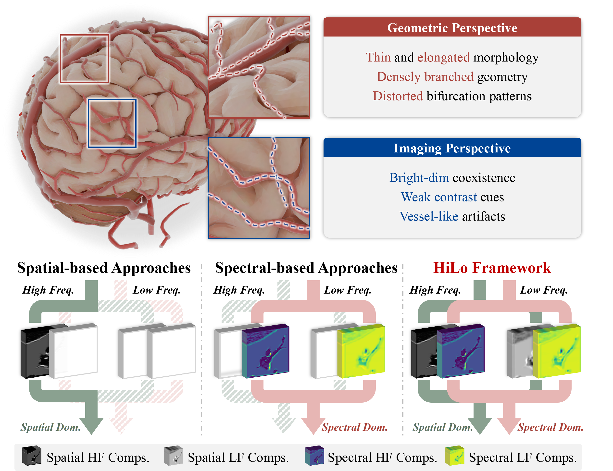
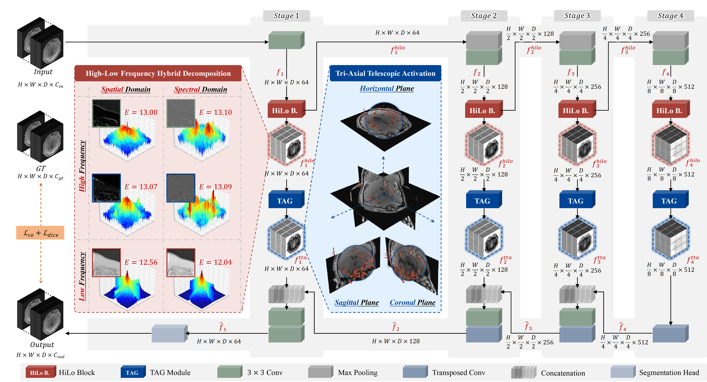
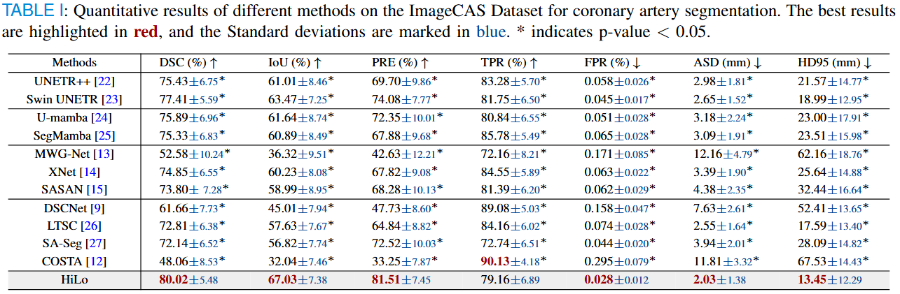
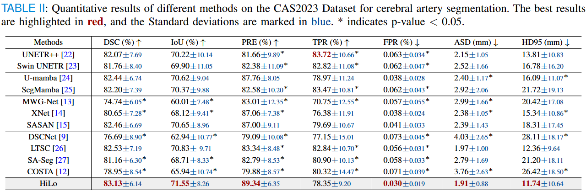
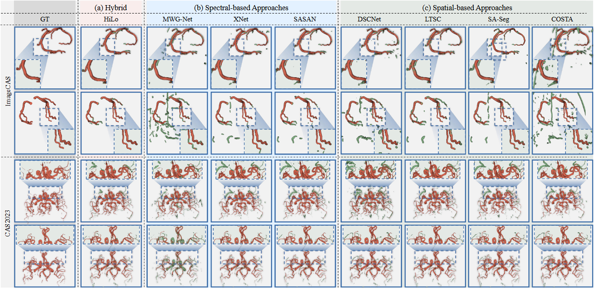

# HiLo: Hybrid High-Low Frequency Activation for Heart and Brain Vessel Segmentation
> More details of this project will be released soon.

Cardio-cerebrovascular vessel segmentation: (a) Spatial-based approaches: Spatial-domain-only operation targeting high-frequency details. (b) Spectral-based approaches: Spectral-domain-only processing of high- and low-frequency components. (c) HiLo framework: Joint spatial-spectral modeling of high- and low-frequency cues.

# Network Architecture
Overview of the HiLo architecture, featuring two core components. The HiLo block in the encoder captures spatial and spectral high-/low-frequency components to preserve fine tubular details and encode large-scale anatomy; the TAG (Fig.  module in skip connections modulates multi-domain features to enhance foreground vessels while suppressing background responses. The inset shows the frequency energy distribution, where E denotes spectral entropy.


# Data Description
The ImageCAS dataset is a large-scale collection dedicated to coronary artery segmentation, comprising 3D CTA images from 1,000 patients diagnosed with coronary artery disease. In terms of imaging parameters, each CT scan features a voxel size of [512×512×206, 512×512×275] and a pixel spacing ranging from 0.25 mm to 0.45 mm.
```
@article{zeng2023imagecas,
  title={ImageCAS: A large-scale dataset and benchmark for coronary artery segmentation based on computed tomography angiography images},
  author={Zeng, An and Wu, Chunbiao and Lin, Guisen and Xie, Wen and Hong, Jin and Huang, Meiping and Zhuang, Jian and Bi, Shanshan and Pan, Dan and Ullah, Najeeb and others},
  journal={Computerized Medical Imaging and Graphics},
  volume={109},
  pages={102287},
  year={2023},
  publisher={Elsevier}
}
```

The CAS2023 dataset is dedicated to cerebral artery segmentation in three-dimensional time-of-flight magnetic resonance angiography (3D TOF-MRA) images, encompassing 100 cases of cerebrovascular 3D TOF-MRA scans from symptomatic patients diagnosed with intracranial arterial stenosis, accompanied by precise manual annotations. The volume sizes of all data are distributed within the range of [208×320×96, 784×784×255]. 
```
@misc{cas2023,
  title        = {Cerebral artery segmentation challenge (cas) 2023},
  howpublished = {\url{https://codalab.lisn.upsaclay.fr/competitions/9804\#learn_the_details-overview}},
  note         = {Accessed: January 10, 2026}, 
  year         = {2023}
}
```
# Benchmark




# Visualization
Qualitative comparison of 3D segmentation results on the ImageCAS and CAS2023 datasets. Red indicates true positives; Green denotes false positives.
